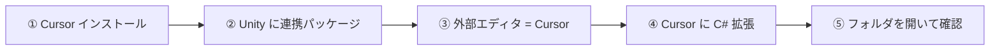
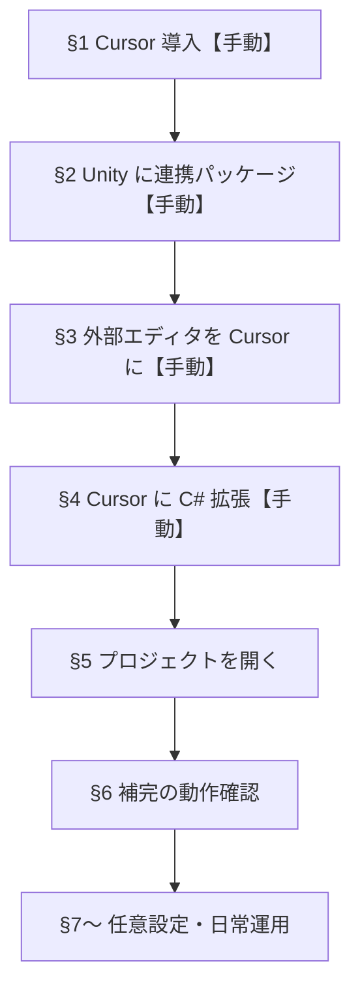

# Cursor × Unity C# 開発環境 セットアップガイド

Windows 11 上で **Cursor** をエディタとして使い、**Unity** プロジェクトの C# スクリプトを編集・補完・デバッグするためのガイド。知識がなくても上から順に進められるよう、手順を細かく記載している。

本リポジトリ（`japan-weather-demo`）のように Unity プロジェクトが `UnityProject\` サブフォルダにある構成を前提とする。Claude Code や unity-mcp のセットアップは別ガイド（[unity-wsl-claudecode-setup-guide.md](./unity-wsl-claudecode-setup-guide.md)）を参照。

---

## 0. 概要・前提

### 構成イメージ



| 場所 | やること |
| ---- | -------- |
| **PC** | Cursor エディタをインストール |
| **Unity** | Cursor 連携パッケージを入れ、外部エディタを Cursor に設定 |
| **Cursor** | C# 用の拡張機能を入れ、プロジェクトフォルダを開く |
| **（任意）** | デバッグ設定・AI 向けルールを追加 |

### 前提条件

| 項目 | 状態・要件 |
| ---- | ---------- |
| OS | Windows 11 |
| Unity Hub + Unity Editor | インストール済み（本リポジトリは Unity 6.3 LTS） |
| インターネット | パッケージ・拡張機能のダウンロード用 |

> **実行メモ（このガイドの進め方）:** これは人間が上から順に実施する手順書。**【手動】**マークの付いたステップは GUI 操作のため、必ず人間が手で行う。

### 全体の流れ



---

## §1. Cursor をインストールする【手動】

1. ブラウザで [https://cursor.com](https://cursor.com) を開く
2. **Download for Windows** をクリックしてインストーラを取得
3. インストーラを実行し、画面の指示に従って完了
4. 初回起動後、サインイン（アカウント作成）を済ませる

**確認:** スタートメニューから「Cursor」が起動できれば OK。

---

## §2. Unity に「Cursor 連携パッケージ」を入れる【手動】

Unity が Cursor を「外部スクリプトエディタ」として認識し、`.csproj`（補完用のプロジェクトファイル）を自動生成するためのパッケージ。

1. **Unity Hub** でプロジェクトを開く（例: `UnityProject`）
2. メニュー **Window → Package Manager** を開く
3. 左上の **＋** → **Add package from git URL...** を選ぶ
4. 次の URL を貼り付けて **Add**:

```
https://github.com/boxqkrtm/com.unity.ide.cursor.git
```

5. インストールが終わるまで待つ（数十秒〜数分）

> **パッケージ名について:** バージョン v2.0.24 以降、パッケージ名は `com.boxqkrtm.ide.cursor` に変更されている。古い `com.unity.ide.cursor` から更新する場合は、先に旧パッケージを削除してから入れ直すこと。

**確認:** Package Manager の **In Project** 一覧に `Cursor IDE`（または類似名）が表示されていれば OK。

---

## §3. Unity の外部スクリプトエディタを Cursor にする【手動】

1. Unity メニュー **Edit → Preferences...**
2. 左の **External Tools** をクリック
3. **External Script Editor** のドロップダウンで **Cursor** を選択
   - 一覧に無い場合: **Browse...** で Cursor の実行ファイルを指定  
     通常の場所: `C:\Users\<ユーザー名>\AppData\Local\Programs\cursor\Cursor.exe`
4. 下の **Regenerate project files** ボタンをクリックする（`.sln` / `.csproj` を生成・更新する。初回設定時やパッケージ追加後に押す）

**確認:** `Assets` 内の `.cs` ファイルをダブルクリックすると Cursor が開けば OK。
**備考:** ここまでの手順で `<local repository>/UnityProject/.vscode` フォルダに `extensions.json`, `launch.json`, `settings.json`が生成される。

---

## §4. Cursor に C# 用の拡張機能を入れる【手動】

### 重要：Microsoft の「C# Dev Kit」は使わない

Microsoft 公式の **C# Dev Kit** は **Visual Studio Code 専用ライセンス**のため、Cursor では動作しない（エラーになることが多い）。Cursor で Unity C# を書く場合は次の構成を使う。

| 拡張機能 | 役割 | 備考 |
| -------- | ---- | ---- |
| **DotRush** | 補完・定義ジャンプ・Unity デバッグ | 拡張機能マーケットから検索してインストール |
| **C#**（Anysphere 製） | Cursor 標準の C# 言語サーバー | 多くの場合 Cursor に同梱済み |

### 手順

1. Cursor を起動
2. 左サイドバーの **拡張機能** アイコンをクリック、または `Ctrl+Shift+X`
3. 検索欄に **DotRush** と入力
4. **DotRush** の **Install** をクリック
5. もし **C#**（Microsoft / `ms-dotnettools.csharp`）や **C# Dev Kit** が入っていたら **アンインストール**（競合の原因になる）
6. **C#**（Anysphere 製）が有効か確認。無ければ拡張機能で「C#」を検索して Anysphere のものを入れる

**確認:** 拡張機能一覧に DotRush が「Enabled」になっていれば OK。

---

## §5. プロジェクトを Cursor で開く

本リポジトリでは **リポジトリのルート**（`UnityProject` のひとつ上）を開くのがおすすめ。`docs/` や設定ファイルも同時に扱える。

### 方法 A：PowerShell から（推奨）

```powershell
cd C:\work\japan-weather-demo
cursor .
```

### 方法 B：Cursor の GUI から

1. Cursor を起動
2. **File → Open Folder...**
3. `C:\work\japan-weather-demo` を選択して **フォルダの選択**

### 初回は Unity のコンパイルを待つ

1. **Unity Editor を起動したまま**にする
2. Unity がスクリプトをコンパイルし終わるまで待つ（右下のプログレスバーが消える）
3. これで `UnityProject` 配下に `.sln` / `.csproj` が生成される

**確認:** Cursor 左のエクスプローラーで `UnityProject\Assets\` 以下の `.cs` が見えれば OK。

---

## §6. 補完・エラー表示が動くか確認する

1. Cursor で任意の `.cs` を開く（例: `UnityProject\Assets\` 内）
2. 次を試す:
   - `MonoBehaviour` と入力して **補完候補**が出るか
   - クラス名の上で **F12**（定義へジャンプ）が動くか
   - わざと typo を入れて **赤い波線**が出るか

### 補完が出ないとき

1. Unity に戻る → **Edit → Preferences → External Tools**
2. **Regenerate project files** をクリック
3. Cursor を一度閉じて開き直す
4. コマンドパレット（`Ctrl+Shift+P`）→ **Developer: Reload Window**

---

## §7. ブレークポイントでデバッグする（任意）

Play モード中にコードを止めて変数を見たい場合の設定。

1. リポジトリに `.vscode` フォルダを作成（Cursor もこの設定を読む）
2. その中に `launch.json` を作成:

```json
{
  "version": "0.2.0",
  "configurations": [
    {
      "name": "Unity Debugger",
      "type": "unity",
      "request": "attach"
    }
  ]
}
```

3. `.cs` の行番号左をクリックしてブレークポイントを置く
4. Unity で **Play** を押す
5. Cursor で **F5** → **Unity Debugger** を選択

Unity が起動・Play 中である必要がある。

---

## §8. 快適にする設定（推奨）

### 8-1. AI のインデックスから Unity の生成物を除外

プロジェクトルートに `.cursorignore` を作成（無ければ）し、次を入れると Cursor の AI が `Library/` などを読まなくなり、速くなる:

```
UnityProject/Library/
UnityProject/Temp/
UnityProject/Logs/
UnityProject/obj/
UnityProject/Build/
UnityProject/Builds/
**/*.meta
```

### 8-2. ターミナルの日本語文字化け（Windows）

統合ターミナルで日本語が `ã®` のように化ける場合:

1. **Cursor を最新版にアップデート**（多くの場合これだけで解消）
2. 直らなければ **File → Preferences → Settings** を開き、右上の **Open Settings (JSON)** から次を追加:

```json
"terminal.integrated.gpuAcceleration": "off"
```

3. Cursor を再起動

> **`terminal.integrated.windowsEnableConpty": false` は設定しない。** 旧来の回避策であり、最新ターミナル描画に必要な ConPTY を無効化してしまう。詳細は [unity-wsl-claudecode-setup-guide.md](./unity-wsl-claudecode-setup-guide.md) のトラブルシューティング表を参照。

### 8-3. AI に Unity の文脈を伝える（任意）

Cursor の AI がプロジェクトのルールを理解しやすくするには、リポジトリルートの `CLAUDE.md` や `.cursor/rules/` に次のような情報を書いておくとよい:

- Unity のバージョン（例: 6000.3.18f1）
- プロジェクトパス（`UnityProject/`）
- コーディング規約（名前空間、フォルダ構成など）

---

## §9. 日々の開発の流れ（推奨ループ）

1. **Unity Hub** でプロジェクトを開く
2. PowerShell でリポジトリルートに移動し Cursor を起動:

```powershell
cd C:\work\japan-weather-demo
cursor .
```

3. Cursor で `.cs` を編集
4. Unity に戻ると自動コンパイル → Console でエラー確認
5. （任意）F5 でデバッグ

Claude Code や unity-mcp を併用する場合の全体ワークフローは [unity-wsl-claudecode-setup-guide.md](./unity-wsl-claudecode-setup-guide.md) の「§9 開発ワークフロー」を参照。

---

## §10. よくあるトラブル

| 症状 | 対処 |
| ---- | ---- |
| 「C# Dev Kit は VS Code 専用」とエラー | Microsoft の C# / C# Dev Kit を削除し、DotRush + Anysphere C# を使う |
| 補完が一切出ない | Unity で Regenerate project files → Cursor を Reload |
| スクリプトをダブルクリックしても Cursor が開かない | §3 の外部エディタ設定を再確認 |
| 拡張機能が競合する | `ms-dotnettools.*` 系をすべて無効化し、DotRush のみ残す |
| `.csproj` が無い | Unity Editor を一度開き、コンパイル完了まで待つ |
| AI が遅い・関係ないファイルを読む | `.cursorignore` に `Library/` 等を追加 |
| 補完が遅い（DotRush） | 設定で `dotrush.roslyn.showItemsFromUnimportedNamespaces` と `dotrush.roslyn.targetTypedCompletionFilter` を無効化 |

---

## 参考リンク

- [boxqkrtm/com.unity.ide.cursor](https://github.com/boxqkrtm/com.unity.ide.cursor) — Unity 側の Cursor 連携パッケージ
- [JaneySprings/DotRush](https://github.com/JaneySprings/DotRush) — Cursor 向け C# 言語サーバー・Unity デバッガ
- [Cursor Docs — Rules](https://docs.cursor.com/context/rules) — AI 向けルールの書き方
- [Cursor Docs — Codebase indexing](https://docs.cursor.com/context/codebase-indexing) — インデックス設定

---

## 本リポジトリでの状態メモ

`UnityProject\Packages\manifest.json` には **unity-mcp**（`com.coplaydev.unity-mcp`）が入っているが、**com.boxqkrtm.ide.cursor**（§2）は未導入の場合がある。Cursor で C# 開発するなら §2〜§3 の実施を推奨する。

unity-mcp は Unity と AI エージェントの連携用であり、スクリプト編集・補完とは独立した機能。セットアップは [unity-wsl-claudecode-setup-guide.md](./unity-wsl-claudecode-setup-guide.md) の「§8-1〜8-5」を参照。
