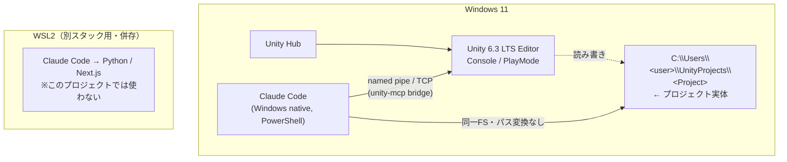
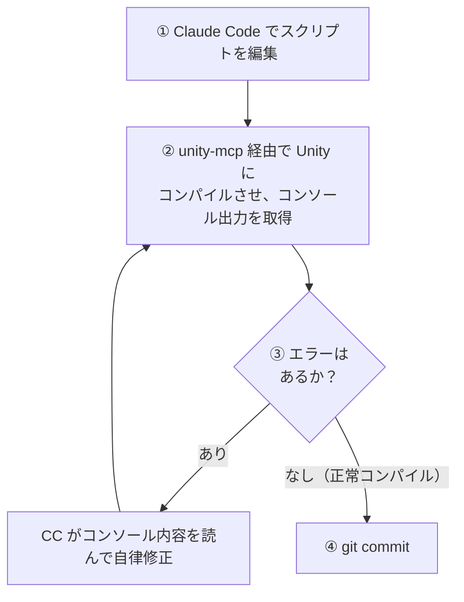

# Unity × Claude Code（Windowsネイティブ構成）開発環境 セットアップガイド

**作成日:** 2026年6月25日

Windows 11 上に **Unity 6.3 LTS** と **Windows版 Claude Code** をインストールし、両方をWindows内で動かして Unity アプリを開発するためのガイド。WSL版 Claude Code は削除せず、Python / Next.js 等の別スタック用に併存させる。

> **設計方針:** Unity と unity-mcp は Windows 上で動き、プロジェクト実体も `C:\`（Windows のファイルシステム）に置く。**Claude Code も Windows 側に置く**ことで、Windows と WSL の境界を跨がずに済み、高速・単純・安定になる。WSL 版 Claude Code から `/mnt/c` 越しに同じプロジェクトを扱うと、I/O 遅延とファイル変更検知（inotify）の不達という不利を常に負うため、本ガイドでは Claude Code も Windows 版を使う。

---

## 0. 概要・前提

### 構成イメージ



### 前提条件

| 項目 | 状態・要件 |
|------|-----------|
| OS | Windows 11 |
| Unity アカウント | 取得済み（無料の Personal でも可） |
| Claude Code サブスク | Pro / Max / Team / Enterprise のいずれか（無料 Claude.ai プランは不可） |
| Git for Windows | **必須**（git / clone / LFS / ssh。§2 手順3 で導入） |
| Python（任意） | statusLine（`statusline.py`、§4）を使う場合のみ必要。`winget install Python.Python.3.12` |
| Node.js（任意） | playwright MCP（§4）や npm 版 CC（§2 代替）を使う場合のみ必要。`winget install OpenJS.NodeJS.LTS` |
| WSL2 + WSL版CC | 既存のまま残す（他スタック用。本ガイドでは触らない） |

> **実行メモ（このガイドの進め方）:** これは人間が上から順に実施する手順書。PowerShell / git / ssh のシェル手順は Windows 版 Claude Code に実行させてもよいが、**🖐 手動 マークの付いたステップは必ず人間が手で行う**（CC には実行できない）。手動になるのは次のいずれか:
>
> - **GUI 操作**（Unity Hub・Unity Editor・インストーラ）
> - **CC の対話操作**（`/login`・`/plugin` などスラッシュコマンド、TUI 内の選択）
> - **管理者権限が必要**な操作（CC のシェルは昇格しない）
> - **ブートストラップ**（CC 本体を入れる §2 自体。CC が使えるようになる前の手順）
> - **外部 Web 操作**（GitHub に SSH 公開鍵を登録する等）
>
> マークの無いシェル手順は CC に任せても手で打ってもよい。

### なぜ WSL版でなく Windows版 CC か

| 観点 | WSL版CC（`/mnt/c`経由） | Windows版CC（ネイティブ） |
|------|------------------------|--------------------------|
| ファイルI/O・検索 | `/mnt/c` 越えで遅い（Unityは大量ファイル） | `C:\` をネイティブ参照で高速 |
| ファイル変更監視（inotify） | Windows側変更がWSLに伝播しない（既知の制約） | ネイティブで正常 |
| Unity / unity-mcp との距離 | WSL↔Windows境界を跨ぐ | 同一OS内で完結・単純 |
| パス変換 | `/mnt/c/...`↔`C:\...` 常時必要 | 不要 |

---

## 1. Windows側：Unity のインストール 🖐 手動

> この章は **全ステップが Unity Hub の GUI 操作**のため手動。

1. **Unity Hub を取得** — [unity.com/download](https://unity.com/download) から Unity Hub を入手してインストール。
2. **サインインとライセンス有効化** — 起動して Unity アカウントでサインイン。`Preferences → Licenses` で Personal 等を有効化。
3. **Editor のインストール** — `Installs` タブ →「Install Editor」→ **Unity 6.3 LTS** を選択。
4. **モジュール選択** — ターゲットに応じて追加。
   - **Windows Build Support (IL2CPP/Mono)** … PC 向けビルドに必要。
   - 必要に応じて **Android Build Support** / **WebGL Build Support** 等。
   - **Visual Studio は任意** — C# は Claude Code で編集するため必須ではない（Unity側のIDE連携が欲しい場合のみ）。
5. **インストール中は Hub を閉じない** — 閉じるとダウンロードがキャンセルされる。完了すると `Installs` タブに表示。

> 参考: [Unity 6 リリース](https://unity.com/releases/unity-6) / [Install Unity（マニュアル）](https://docs.unity3d.com/6000.4/Documentation/Manual/GettingStartedInstallingUnity.html) / [Install the Unity Hub](https://docs.unity.com/en-us/hub/install-hub)

---

## 2. Windows版 Claude Code のインストール 🖐 手動

> この章は **CC を使えるようにするブートストラップ**のため手動（インストーラ実行・Git for Windows の GUI インストール・`/login` 認証を含む）。

1. **PowerShell を開く**（CMD と取り違え注意：プロンプトが `PS C:\...>` ならPowerShell）。
2. **ネイティブインストーラを実行**（推奨。Node.js不要・管理者権限不要・自動更新）:

   ```powershell
   irm https://claude.ai/install.ps1 | iex
   ```
   バイナリは `%LOCALAPPDATA%\Programs\ClaudeCode` に入る。完了後:

   ```powershell
   claude --version
   ```

3. **Git for Windows を導入（git / git clone / Git LFS / ssh に必須）** — [git-scm.com](https://git-scm.com/download/win) から導入する。`git` 本体・`git-lfs`・**Git Credential Manager**・`ssh` を同梱しており、§3（SSH/git 設定）と §5-B（`git clone`）はこれに依存する。**Windows 標準にもネイティブ CC インストーラにも `git` は含まれない**ため、ここを省くと後続で詰まる。導入後に確認:

   ```powershell
   git --version
   git lfs version
   ```
   - 補足: Claude Code が **Bash ツール**を使えるのは「追加の利点」。これとは別に、上記 git ツールチェーン自体が必須。Git for Windows 未導入時は CC のシェルが PowerShell になる（v2.1.139 以降はネイティブ PowerShell ツールが標準）。
   - `ssh-agent`（§3）に使う **Windows OpenSSH Client は Windows 11 標準**で導入済み。`ssh -V` で確認できる。
   - **導入後は PowerShell / Claude Code を再起動**する（既存セッションには `git` が PATH 反映されない）。
4. **認証と診断** — サブスクのアカウントでサインインし、導入状態を確認:

   ```powershell
   claude doctor    # 導入種別 / 認証 / PATH / Git健全性を点検
   ```

### つまずきやすい点

| 症状 | 対処 |
|------|------|
| `irm` は認識されない | CMD にいる。PowerShell を開き直す |
| `'&&' は有効な区切りではない` | PowerShell にいる（`&&` は CMD 用）。コマンドを分けるか PowerShell 構文で |
| インストール後 `claude` が見つからない | PowerShell を閉じて開き直す（PATH反映） |
| スクリプトがブロックされる | `Set-ExecutionPolicy -ExecutionPolicy RemoteSigned -Scope CurrentUser` |

> **代替（npm版）:** Node.js 18+（22 LTS推奨）がある環境なら `npm install -g @anthropic-ai/claude-code`。更新は手動（`...@latest`）。特段の理由がなければネイティブインストーラを推奨。
>
> 参考: [Claude Code Advanced setup（公式）](https://code.claude.com/docs/en/setup)

---

## 3. WSL → Windows への Git / SSH 設定の移行

これまで Git 認証・SSH 鍵は WSL 側にしか無かったため、Windows 側で `git clone` / `push` できるよう移行する。**最大の落とし穴は SSH 秘密鍵のパーミッション（ACL）** で、ここを正しくしないと Windows OpenSSH が鍵を拒否する。

### コピー対象（このマシンの実態に合わせた一覧）

| 対象 | コピー元（WSL） | コピー先（Windows） | 注意 |
|------|----------------|---------------------|------|
| Git ユーザー設定 | `~/.gitconfig` | `C:\Users\<WinUser>\.gitconfig` | name/email は移行。**LFS 行は `git lfs install` で再生成**するのが確実 |
| SSH 秘密鍵 | `~/.ssh/id_ed25519` | `%USERPROFILE%\.ssh\id_ed25519` | **ACL 設定が必須**（後述） |
| SSH 公開鍵 | `~/.ssh/id_ed25519.pub` | `%USERPROFILE%\.ssh\id_ed25519.pub` | そのままコピー |
| 既知ホスト | `~/.ssh/known_hosts` | `%USERPROFILE%\.ssh\known_hosts` | 任意（ホスト再検証を省ける） |
| GPG 署名鍵 | （未使用） | — | 現状 GPG 署名なしのため対象外 |

> **Windows のユーザー名は WSL の `defaultuser` と異なる場合がある。** 実パスは PowerShell で `echo $env:USERPROFILE`（例 `C:\Users\altair`）を確認して読み替えること。

### 手順

**1. 鍵ファイルをコピー（WSL のターミナルから）**

WSL からは Windows のホームが `/mnt/c/Users/<WinUser>/` で見える。`<WinUser>` を実際の名前に置換して実行:

```bash
mkdir -p /mnt/c/Users/<WinUser>/.ssh
cp ~/.ssh/id_ed25519 ~/.ssh/id_ed25519.pub ~/.ssh/known_hosts /mnt/c/Users/<WinUser>/.ssh/
```

> これは **WSL の bash** で実行する。Windows 版 Claude Code（PowerShell）から実行させたい場合は `wsl` 経由で呼ぶ:
> `wsl bash -lc "mkdir -p /mnt/c/Users/<WinUser>/.ssh && cp ~/.ssh/id_ed25519 ~/.ssh/id_ed25519.pub ~/.ssh/known_hosts /mnt/c/Users/<WinUser>/.ssh/"`

**2. 秘密鍵の ACL を本人のみに制限（PowerShell）** ← 最重要

これを怠ると `Permissions for '...id_ed25519' are too open ... This private key will be ignored.`（UNPROTECTED PRIVATE KEY FILE）で拒否される。`ssh-add` も同じチェックを行うため、**必ず先に実行**する。

```powershell
icacls "$env:USERPROFILE\.ssh\id_ed25519" /inheritance:r
icacls "$env:USERPROFILE\.ssh\id_ed25519" /grant:r "$($env:USERNAME):F"
```

- `/inheritance:r` … フォルダから継承した広い権限を断ち切る。
- `/grant:r "...:F"` … 自分のアカウントだけに Full control を付与（他ユーザー・Everyone を排除）。

**3. ssh-agent を有効化して鍵を登録（管理者 PowerShell）** 🖐 手動（要管理者）

> サービス操作に**管理者昇格**が必要。CC のシェルは昇格しないため、**管理者として開いた PowerShell** で手で実行する。

```powershell
Get-Service ssh-agent | Set-Service -StartupType Automatic
Start-Service ssh-agent
ssh-add "$env:USERPROFILE\.ssh\id_ed25519"
```

**4. Git の identity と LFS、改行設定（PowerShell）**

```powershell
git config --global user.name  "Kiyoshi Ishiyama"
git config --global user.email "altair@nasubee.com"
git lfs install                        # LFS 使用プロジェクトのため Windows 側でも必須
git config --global core.autocrlf false  # 改行は .gitattributes に委ねる（アセット破壊を防ぐ）
```

**5. 疎通確認**

```powershell
ssh -T git@github.com    # "Hi <user>! You've successfully authenticated..." が出れば OK
```

> **メモ:**
> - 秘密鍵はマシン間で持ち回らず、**Windows 用に新しい鍵を生成**して GitHub に公開鍵を登録する運用も安全。その場合は `ssh-keygen -t ed25519 -C "altair@nasubee.com"` を PowerShell で実行し、生成された `.pub` を GitHub の SSH keys に追加する（手順 1・2 のコピーは不要、ACL は ssh-keygen が適切に設定する）。**GitHub への公開鍵登録は Web 操作のため 🖐 手動。**
> - HTTPS で GitHub を使う場合は Git for Windows 同梱の **Git Credential Manager** が認証を肩代わりするため、SSH 鍵は不要。

---

## 4. Claude Code 本体の状態（グローバル設定）の移行

WSL 側 Claude Code には、これまで蓄積したユーザースコープの設定・プラグイン・MCP がある。これらは Windows 版へ自動では引き継がれない（§6 のとおり `~/.claude` は環境ごとに別物）。**移植すべきは「設定・拡張」だけで、認証情報や履歴・キャッシュはコピーしない**（機密/マシン固有/パス依存のため）。

### 移植する / しない の判断（このマシンの実態）

| 区分 | 対象 | 扱い |
|------|------|------|
| ✅ 移植する | `settings.json`（model=opus / 言語=Japanese / effortLevel=high / voice / theme / statusLine / enabledPlugins） | 内容をコピー（一部パス調整） |
| ✅ 移植する | `statusline.py`（カスタムステータスライン） | コピー。**Windows に Python が必要** |
| ✅ 移植する | プラグイン **superpowers**（`anthropics/claude-plugins-official`） | **再インストール**（キャッシュはコピーしない） |
| ✅ 移植する | ユーザー MCP **context7**（HTTP＋APIキー）/ **playwright**（npx） | `claude mcp add` で**再登録** |
| ❌ しない | `.credentials.json`（OAuth トークン） | コピー禁止。Windows で**再ログイン** |
| ❌ しない | `~/.claude.json` 全体（machineID / userID / oauthAccount / Linux のプロジェクトパス等） | 丸ごとコピー不可。MCP だけ上記で再登録 |
| ❌ しない | `projects/` `sessions/` `history.jsonl` `file-history/` `cache/` 等 | 履歴・セッション・パス依存。移植不要 |

### 手順（Windows・PowerShell）

**1. 再ログイン（トークンはコピーしない）** 🖐 手動

```powershell
claude            # 起動して /login でサインイン（§2 で導入済みの Windows 版 CC）
```
> `/login` は CC 起動後の**対話操作**のため手動。

**2. `settings.json` を移植**

`%USERPROFILE%\.claude\settings.json` を作成し、下記を貼り付ける（WSL 版とほぼ同一。`statusLine` の Python 実行コマンドだけ Windows 向けに調整）。**`<WinUser>` は実際の Windows ユーザー名に置換する**:

```json
{
  "model": "opus",
  "language": "Japanese",
  "effortLevel": "high",
  "theme": "dark",
  "voice": { "enabled": true, "mode": "hold" },
  "voiceEnabled": true,
  "statusLine": {
    "type": "command",
    "command": "python C:\\Users\\<WinUser>\\.claude\\statusline.py",
    "refreshInterval": 60
  },
  "enabledPlugins": {
    "superpowers@claude-plugins-official": true
  }
}
```
- **注意:** `statusLine.command` に **`%USERPROFILE%` や `~` を書かない**（settings.json 内では展開されず statusline が動かない）。上記のように**絶対パス**で書く。導入後にステータスラインが表示されない場合はこのパスを疑う。`python` が PATH に無ければ `py` または絶対パスに置換。

**3. `statusline.py` をコピー**（WSL から）

```bash
cp ~/.claude/statusline.py /mnt/c/Users/<WinUser>/.claude/statusline.py
```
- ステータスラインには **Windows 版 Python** が必要（未導入なら `winget install Python.Python.3.12` 等）。Python を入れない場合は手順2の `statusLine` ブロックを削除すればよい。

**4. プラグイン（superpowers）を再インストール** 🖐 手動

起動中の Claude Code で（**スラッシュコマンドの対話操作**のため手動）:

```
/plugin marketplace add anthropics/claude-plugins-official
/plugin install superpowers@claude-plugins-official
```
手順2の `enabledPlugins` により有効化される。`find-skills` 等のスキルもここで復元される。

**5. ユーザー MCP を再登録**

```powershell
# context7（HTTP・各自の API キーを指定）
claude mcp add --transport http --scope user context7 https://mcp.context7.com/mcp `
  --header "CONTEXT7_API_KEY: <your-context7-api-key>"

# playwright（stdio・npx。Node.js が必要）
claude mcp add --scope user playwright -- npx @playwright/mcp@latest --browser chromium
npx playwright install chromium
```

> **メモ:** `<your-context7-api-key>` は WSL 側の値を流用してよいが、鍵そのものはこのドキュメントに残さないこと。playwright は Node.js（§2 の npm 版 CC を入れていなければ別途）と Chromium が必要。

**6. 動作確認**

```powershell
claude mcp list      # context7 / playwright が出るか
claude doctor        # 設定・プラグインの健全性
```
起動中の CC で `/plugin` でプラグイン、ステータスラインの表示も確認する。

---

## 5. プロジェクトの配置（新規作成 または Clone）

### 配置先（共通）

```
C:\Users\<user>\UnityProjects\<ProjectName>
```
- **パスにスペース・日本語を含めない**（ツールの取り回しが楽）。
- Unity も Claude Code も**同じネイティブパス**を見る（`/mnt/c` 変換は不要）。

新規に作るなら **5-A**、既存リポジトリを取得するなら **5-B** に進む。

### 5-A. 新規プロジェクトを作成

1. 🖐 手動: Unity Hub の `Projects` →「**New Project**」で Unity 6.3 LTS のテンプレート（2D / 3D / Universal 3D(URP) 等）を選び、上記フォルダに作成（Unity Hub の GUI 操作）。
2. Git を初期化（PowerShell、§3 の git 設定が前提）:

   ```powershell
   cd C:\Users\<user>\UnityProjects\<ProjectName>
   git init
   # Unity 公式 .gitignore を取得
   irm https://raw.githubusercontent.com/github/gitignore/main/Unity.gitignore -OutFile .gitignore
   ```
   - `Library/`・`Temp/`・`Obj/`・`Logs/`・`Build/` 等の自動生成物は必ず除外（巨大かつ再生成可能、CC の走査も軽くなる）。
   - 改行コードは単一OS運用なら問題になりにくいが、将来のチーム共有/WSL併用に備え `.gitattributes` に `* text=auto` を入れておくと無難。

### 5-B. 既存リポジトリを Clone

§3 で移行した SSH 鍵・git 設定をそのまま使う（HTTPS の場合は初回に Git Credential Manager が認証）。

```powershell
cd C:\Users\<user>\UnityProjects
git clone git@github.com:<org>/<repo>.git    # SSH。HTTPS なら https://github.com/<org>/<repo>.git
cd <repo>
git lfs pull                                  # LFS 資産を取得（git lfs install 済みなら clone 時に自動取得）
```

- 🖐 手動: Unity Hub →「**Add → Add project from disk**」でクローンしたフォルダを選び、**一致する Editor バージョン（6.3 LTS）で開く**（New Project ではない。Unity Hub の GUI 操作）。バージョンが一致しないと Hub が警告するので、必要なら該当 Editor を追加インストール。

### Claude Code で開く（5-A / 5-B 共通）

PowerShell でプロジェクトに移動して起動:

```powershell
cd C:\Users\<user>\UnityProjects\<ProjectName>
claude
```

---

## 6. CLAUDE.md と「設定共有」戦略

プロジェクト直下に `CLAUDE.md` を置き、CC に環境コンテキストを伝える（Windows/PowerShell 前提）。

```markdown
# プロジェクト環境ルール

## 実行環境
- コマンドは Windows 上で実行される（PowerShell、または Git Bash）。
- プロジェクトの実体は C:\Users\<user>\UnityProjects\<Project>。
- Unity Editor は同じ Windows 上で動いている。

## Unity ファイルの扱い
- Library/ Temp/ obj/ Logs/ Build/ は自動生成物。編集・コミットしない。
- *.meta ファイルは削除・改名しない（アセット参照が壊れる）。
- C# スクリプトの追加・変更後は Unity 側のコンパイルが必要。

## ワークフロー規約
- 変更は小さくまとめ、各変更ごとに git commit する。
- コンパイル結果・エラーは unity-mcp 経由で Unity のコンソールから取得して確認する。
- 推測で書かず、コンソールのエラー内容に基づいて修正する。
```

### 設定の共有について（重要）

Windows版CC と WSL版CC は `~/.claude`（= `C:\Users\<user>\.claude` と WSL の `/home/<user>/.claude`）が**別物**で、会話履歴・undo履歴・memory・コマンド履歴は**環境ごとに独立**する。プロジェクトの識別キー（slug）もパス差で別になるため、履歴の突き合わせはできない。

→ **両環境で揃えたい設定は、リポジトリ内にコミットして共有する**のが唯一クリーンな方法:

| 共有できる（repoに入れる） | 共有されない（環境ごと独立） |
|---------------------------|------------------------------|
| `CLAUDE.md`、`.claude/commands/`、`.claude/agents/`、project スコープの `.claude/settings.json` | 会話 transcript、undo/file-history、`history.jsonl`、memory、user スコープの skills/MCP/プラグイン |

なお**コード（実ファイル）そのものは git 経由で当然共有される**。同期したいのは「CC の設定・運用ルール」であり、それは上記の repo コミットで担保する。

---

## 7. unity-mcp（CoplayDev）の導入と接続

CC が Unity のコンソール・コンパイル結果を直接読めるようにする。**Node.js 等の追加ランタイム不要。** Windows 内ローカル接続なので構成は単純。

> **手順 1〜3 は Unity Editor の GUI 操作のため 🖐 手動**（CC からは操作できない）。

1. 🖐 手動: **Unity 側にパッケージ追加** — `Window → Package Manager → +（左上）→ Add package from git URL` に貼り付け:

   ```
   https://github.com/CoplayDev/unity-mcp.git?path=/MCPForUnity#main
   ```

2. 🖐 手動: **MCP 設定を開く** — `Window → MCP for Unity`。既定ポート `8080` が他サービス（Tailscale 等）と競合する場合は `8090` 等へ変更。
3. 🖐 手動: **Claude Code を接続** — クライアント一覧から **Claude Code** を選び `Configure` → `Start Session`。
4. **接続確認** — PowerShell の Claude Code で:

   ```powershell
   claude mcp list    # 登録一覧
   ```
   起動中の CC では `/mcp` で状態確認。
5. **動作確認プロンプト例:**
   - 「現在のシーンに赤・青・黄のキューブを作成して」
   - 「コンソールのエラーを読んで、原因のスクリプトを修正して」

### 既知のハマりどころ

| 症状 | 対処 |
|------|------|
| http ↔ stdio モードを切り替えた | Claude Code を再起動して設定を再読込 |
| 接続できない／ポートエラー | ポートを `8090` 等に変更（`8080` 競合回避） |
| `claude` が見つからない | PATH の通った環境から起動、または MCP 設定で CC の絶対パスを指定 |
| VS Code 拡張の CC で MCP が出ない | 拡張版は MCP 設定 UI 未対応。**CLI 版**の Claude Code で設定する |

> 参考: [CoplayDev/unity-mcp](https://github.com/CoplayDev/unity-mcp) / Wiki「[Fix Unity MCP and Claude Code](https://github.com/CoplayDev/unity-mcp/wiki/2.-Fix-Unity-MCP-and-Claude-Code)」

---

## 8. 開発ワークフロー（推奨ループ）



- Windows ネイティブのため**ファイル変更検知は正常**。保存後 Unity にフォーカスを移すと再コンパイルが走り、MCP 経由でトリガもできる。
- 自律修正ループで意図しない変更が入ることがあるため、動いた時点で都度 commit して巻き戻せるようにする。

---

## 9. トラブルシューティング & 付録

### Windows固有のよくある問題

| 問題 | 対処 |
|------|------|
| PowerShell スクリプトがブロック | `Set-ExecutionPolicy -ExecutionPolicy RemoteSigned -Scope CurrentUser` |
| `claude` 未認識 | PowerShell を再起動（PATH反映）。`claude doctor` で点検 |
| PowerShellツールを使いたい | v2.1.139 以降で標準化。段階的ロールアウトのため未適用なら opt-in |
| MCP ポート競合 | 設定ポートを `8090` 等へ変更し CC を再起動 |
| `.meta` 不整合・参照切れ | `.meta` を削除・改名しない。誤削除時は Unity が再生成するが参照は再設定が必要 |

### Claude Code の使い分け（このマシンの方針）

| 用途 | 使う CC |
|------|---------|
| この Unity プロジェクト | **Windows版 Claude Code** |
| Python / Next.js 等のアプリ開発 | **WSL版 Claude Code**（従来どおり） |

履歴（会話・undo・memory）は両者で独立する。設定を揃えたい場合は §6 のとおり repo 内に `CLAUDE.md` / `.claude/` をコミットして共有する。

### 付録：WSL構成（代替案）

どうしても WSL 上の Claude Code で Unity を扱いたい場合は、**プロジェクトを WSL ファイルシステム（`~/`）側に置き**、Unity からは `\\wsl$\<Distro>\home\<user>\...` で参照する。`/mnt/c` を常用する構成（Windows側にプロジェクト＋WSLのCC）は、CC が `/mnt/c` のI/O遅延・inotify不達を負うため非推奨。本ガイドが Claude Code も Windows 版にしているのはこのため。

### 参考リンク集

- Claude Code 公式セットアップ（Windows/PowerShell/Git for Windows）: <https://code.claude.com/docs/en/setup>
- Win32-OpenSSH 各種ファイルの権限保護（SSH鍵のACL）: <https://github.com/PowerShell/Win32-OpenSSH/wiki/Security-protection-of-various-files-in-Win32-OpenSSH>
- Unity 6 リリース / サポート: <https://unity.com/releases/unity-6> ・ <https://unity.com/releases/unity-6/support>
- Install Unity（マニュアル）: <https://docs.unity3d.com/6000.4/Documentation/Manual/GettingStartedInstallingUnity.html>
- Unity Hub: <https://unity.com/download> ・ <https://docs.unity.com/en-us/hub/install-hub>
- CoplayDev unity-mcp: <https://github.com/CoplayDev/unity-mcp>
- Unity 公式 MCP（参考）: <https://unity.com/blog/unity-ai-mcp-how-to-get-started>
